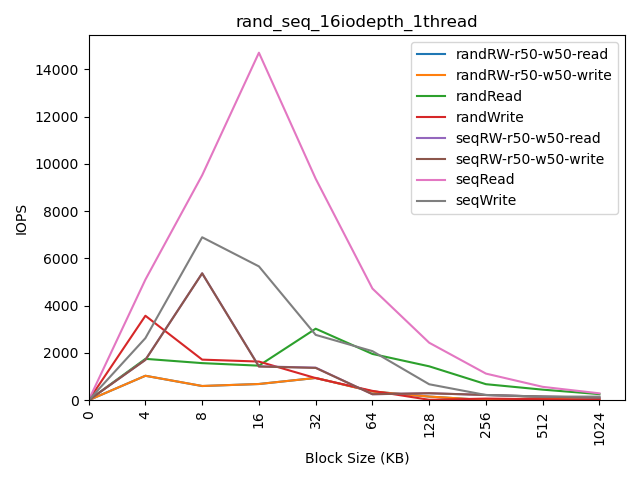
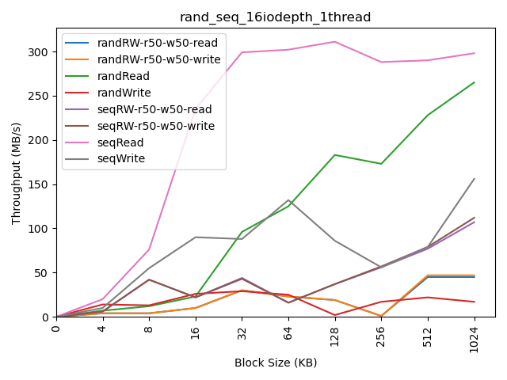
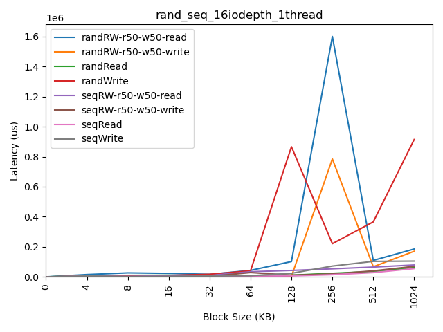

# Отчет по тестовому заданию бенчмарикнга дисковой системы с использованием FIO.

# Описание сценария тестирования:
1. Подготовка и запуск тестов

Сценарий предполагает выполнение ряда тестов с различными размерами блоков данных, используя конфигурационный файл для fio, который задает тип операций ввода-вывода (чтение, запись, смешанная нагрузка).

Параметры теста передаются через командную строку.

2. Сценарий выполнения

    * Инициализация:
        Скрипт проверяет существование блочного устройства и конфигурационного файла fio.
        Создается директория для хранения результатов на основе текущего времени и параметров теста.

    * Запуск тестов:
        Тесты выполняются для набора блоков данных: 4КБ, 8КБ, 16КБ, 32КБ, 64КБ, 128КБ, 256КБ, 512КБ, 1024КБ.
        Для каждого размера блока выполняется команда fio, с параметрами, такими как глубина очереди, количество потоков и процент чтения/записи.
        Результаты каждого теста сохраняются в формате JSON в директорию результатов.

    * Очистка устройства:
        Перед каждым тестом выполняется команда blkdiscard для очистки блочного устройства, если оно является твердотельным накопителем (SSD). Это делается для обеспечения чистого состояния устройства перед каждым тестом.

3. Постобработка результатов

После завершения тестов, выполняется анализ собранных данных с помощью скрипта parser.py.
    
    Чтение результатов:
            Для каждого размера блока скрипт читает соответствующий JSON файл, содержащий данные о производительности (IOPS, Throughput, Latency).
        Форматирование данных:
            Результаты форматируются:
                IOPS (операции ввода-вывода в секунду).
                Throughput (пропускная способность в MB/s).
                Latency (задержка в микросекундах).
        Создание CSV-файлов:
            Два CSV-файла создаются в директории:
                read.csv: Содержит данные для операций чтения.
                write.csv: Содержит данные для операций записи.

4. Параметры тестирования

    * Типы операций:
        Чтение, запись или смешанная нагрузка в зависимости от переданного параметра rwmixread.
    * Диапазон блоков:
        Тесты выполняются для разных размеров блоков от 4КБ до 1024КБ.
    * Глубина очереди (iodepth):
        Глубина очереди (количество параллельных операций ввода-вывода) настраивается параметром iodepth.
    * Количество потоков (njobs):
        Количество параллельных потоков, выполняющих операции ввода-вывода, настраивается параметром njobs.
    * Время выполнения теста (time):
        Параметр time задает максимальную продолжительность выполнения теста. Тест будет завершен, когда достигнет этого времени или выполнит все запланированные операции ввода-вывода, в зависимости от того, что произойдет первым. Это позволяет контролировать длительность тестирования и адаптировать его к конкретным требованиям.
    * Размер данных для операций (size):
        Параметр size определяет, сколько данных будет читаться или записываться в ходе теста. По умолчанию задано значение '80%', что означает, что тест будет работать с 80% доступного пространства на устройстве. Это позволяет тестировать производительность на реальных условиях, не занимая все доступное пространство.

5. Ожидаемые результаты

       IOPS (input/output per second): Показывает среднее количество операций ввода-вывода в секунду.
       Throughput (Пропускная способность): Измеряет среднее количество переданных данных в мегабайтах в секунду.
       Latency (Задержка): Показывает среднее время задержки операции. 
***

# Результаты Бенчмаркинга:

Скрипт plotfio.py отвечает за создание графиков изменения показателей производительности, относительно размера блока.
Этот скрипт использует библиотеку matplotlib для построения графиков.

Вот графики для конфигурации iodepth = 16, numjobs = 1: 

# Анализ результатов Бенчмаркинга:

Исходя из полученных графиков, можно увидеть, броосающиеся в глаза, слабые места в обасти 128KB и 256KB.
Средня задержка ввода-вывода на этом участке в бенчмарках случайной записи и случайного чтения-записи, как для чтения так и для записи сильно подскакивает, вплоть до 1.6 секунд.

На графике пропускной способности, на этом участке, почти все бенчмарки показывают спад пропускной способности.

Самые высокие показатели производительности наблюдаются на блоке размером 16KB. Здесь на графиках iOPS и пропускной способности
виден резкий рост в бенчмарке последовательного чтения, однако бенчмарк seqRW-r50-w50 на этом участке идет на спад, что говорит об узком месте для задачи последовательного параллельного записи и чтения на этом блоке, несмотря на то, что по отдельности последовательное чтение и запись на этом участке имеют неплохие показатели производительности.